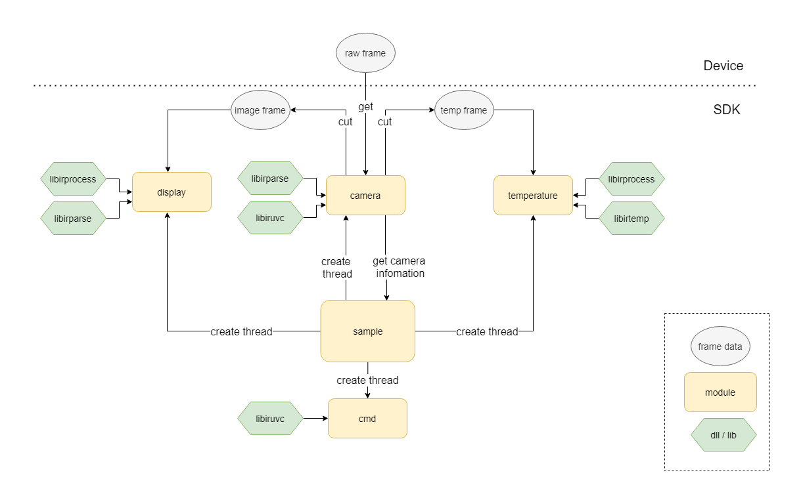

# libirsample示例程序结构以及使用流程介绍


## 一、程序结构



如图，sample分为了sample、camera、display、temperature、cmd等模块，每个模块作用如下：

**sample模块**：在sample.cpp中配置好了相关参数之后，调用camera模块，与红外机芯建立连接，并控制出图。之后sample会创建stream、display、temperature、cmd这四个线程用于对应信息的处理。

**camera模块**：用于获取机芯信息，当stream线程获取到原始红外帧信息的时候，会将红外帧信息raw frame切分为图像信息image frame和温度信息temp frame，并发送信号，传递给对应的模块做相应的处理，当image frame和temp frame处理完成后发送信号给camera线程，camera线程继续下一次循环。

**display模块**：获取图像帧信息之后，根据之前frame_info里参数的设定，做图像数据格式转换、翻转/镜像、旋转等处理，最后调用opencv显示出来图像。

**temperature模块**：获取温度帧信息之后，根据之前frame_info里参数的设定，做图像数据格式转换、翻转/镜像、旋转等处理。

**cmd模块**：控制发送对应的命令给红外机芯。


## 二、程序编译方式

在windows平台，libir_sample文件夹下已经提供了一个完整的VS2019工程，运行示例需要opencv库和pthreadVC2.dll（已经放入）。

在linux平台，libir_sample文件夹下提供了 `Makefile` 和`CMakeLists.txt`文件，在编译时需要删除opencv2文件夹（Linux需要另行安装）。如果不需要opencv，可以在display.h文件中，注释掉`#define OPENCV_ENABLE`，并在 `Makefile` 或`CMakeLists.txt`中注释掉opencv相关内容，然后再编译。


## 三、程序使用流程

### 1.连接机芯

在sample.cpp的main函数中，通过调用ir_camera_open来选择对应的机芯，并从机芯获取相关的参数信息stream_frame_info。

在获取到参数信息之后，还需要调用load_stream_frame_info函数来补充对display和temperature两个模块的设置，比如宽高信息，旋转/镜像/翻转设置，是否需要调用库中自带的伪彩映射表，输入格式和输出格式，申请buffer空间等。

```c
        stream_frame_info->image_info.width = stream_frame_info->camera_param.width;
        stream_frame_info->image_info.height = stream_frame_info->camera_param.height / 2;
        stream_frame_info->image_info.rotate_side = LEFT_90D;
        stream_frame_info->image_info.mirror_flip_status = STATUS_MIRROR_FLIP;
        stream_frame_info->image_info.pseudo_color_status = PSUEDO_COLOR_ON;
		stream_frame_info->image_info.img_enhance_status = IMG_ENHANCE_OFF;
        stream_frame_info->image_info.input_format = INPUT_FMT_YUV422; 	//only Y14 or Y16 mode can use enhance and pseudo color
        stream_frame_info->image_info.output_format = OUTPUT_FMT_BGR888; //if display on opencv,please select BGR888

        stream_frame_info->temp_info.width = stream_frame_info->camera_param.width;
        stream_frame_info->temp_info.height = stream_frame_info->camera_param.height / 2;
        stream_frame_info->temp_info.rotate_side = NO_ROTATE;
        stream_frame_info->temp_info.mirror_flip_status = STATUS_NO_MIRROR_FLIP;
        stream_frame_info->image_byte_size = stream_frame_info->image_info.width * stream_frame_info->image_info.height * 2;
        stream_frame_info->temp_byte_size = stream_frame_info->temp_info.width * stream_frame_info->temp_info.height * 2;
```


如下是StreamFrameInfo_t结构体的定义，注意这几项参数：

FrameInfo_t-width/height:宽高参数，需要填写

FrameInfo_t-byte_size:frame_info当前的字节大小，在出图显示的时候，display.cpp的display_image_process函数里会根据数据格式来计算填写

FrameInfo_t-rotate_side/mirror_flip_status:翻转/镜像、旋转等状态，需要填写

FrameInfo_t-input_format/output_format:输入和输出的数据格式，比如Y14数据输入，RGB888输出，需要填写

FrameInfo_t-pseudo_color_status:伪彩色开关，如果打开会调用libirprocess库内的伪彩映射表，需要填写

FrameInfo_t-img_enhance_status:图像拉伸开关，如果打开会调用libirprocess库内的图像拉伸算法，将Y14/Y16数据拉伸，需要填写

StreamFrameInfo_t-image_byte_size/temp_byte_size:输入帧数据的字节大小，填0即收不到数据，根据需要切分的数据大小来填写

```c
typedef struct {
    uint32_t width;
    uint32_t height;
    uint32_t byte_size;
    RotateSide_t rotate_side;
    MirrorFlipStatus_t mirror_flip_status;
    InputFormat_t  input_format;
    OutputFormat_t  output_format;
    PsuedoColor_t  pseudo_color_status;
    ImgEnhance_t   img_enhance_status;
}FrameInfo_t;

typedef struct {
    uint8_t* raw_frame;
    uint8_t* image_frame;
    uint32_t image_byte_size;
    uint8_t* temp_frame;
    uint32_t temp_byte_size;
    FrameInfo_t image_info;
    FrameInfo_t temp_info;
    CameraParam_t camera_param;
}StreamFrameInfo_t;
```


### 2.控制出图

在打开设备，获取到相关的参数信息，并补充完对display和temperature两个模块的参数设置之后，就可以调用ir_camera_stream_on或ir_camera_stream_on_with_callback（打开宏USER_FUNCTION_CALLBACK，就可以调用自定义回调函数）来出图了。display.cpp的display_function中，在等待到一帧的信号之后调用display_one_frame。

```c
	while (is_streaming)
	{
#if defined(_WIN32)
		WaitForSingleObject(image_sem, INFINITE);	//waitting for image singnal 
#elif defined(linux) || defined(unix)
		sem_wait(&image_sem);
#endif
		display_one_frame(stream_frame_info);
#if defined(_WIN32)
		ReleaseSemaphore(image_done_sem, 1, NULL);
#elif defined(linux) || defined(unix)
		sem_post(&image_done_sem);
#endif
		i++;
	}
```


在display_one_frame函数中，会调用display_image_process来处理图像数据格式，根据stream_frame_info->image_info的输入输出的数据格式input_format、output_format，以及伪彩设置pseudo_color_status，来调用libirparse库做对应的转换。然后再根据stream_frame_info->image_info的mirror_flip_status和rotate_side等状态，做对应的旋转、镜像、翻转操作。最后用opencv的imshow函数显示出来。

```c
	display_image_process(stream_frame_info->image_frame, pix_num, &stream_frame_info->image_info);
	if ((stream_frame_info->image_info.rotate_side == LEFT_90D)|| \
		(stream_frame_info->image_info.rotate_side == RIGHT_90D))
	{
		width = stream_frame_info->image_info.height;
		height = stream_frame_info->image_info.width;
	}

	mirror_flip_demo(&stream_frame_info->image_info, image_tmp_frame2, \
					stream_frame_info->image_info.mirror_flip_status);
	rotate_demo(&stream_frame_info->image_info, image_tmp_frame2, \
				stream_frame_info->image_info.rotate_side);

	cv::Mat image = cv::Mat(height, width, CV_8UC3, image_tmp_frame2);
	putText(image, frameText, cv::Point(11, 11), cv::FONT_HERSHEY_PLAIN, 1, cv::Scalar::all(0), 1, 8);
	putText(image, frameText, cv::Point(10, 10), cv::FONT_HERSHEY_PLAIN, 1, cv::Scalar::all(255), 1, 8);
	cv::imshow("Test", image);
	cvWaitKey(5);
```


在stream_function函数中，可以通过设置stream_time的数值来控制出图的时长，这边是循环出图100*fps帧，在没有丢帧、超时的时候，一般出图时长就是100秒。

        int stream_time = 100;  //unit:s
        while (is_streaming && (i <= stream_time * fps))//display stream_time seconds
        {
    #if defined(_WIN32)
            WaitForSingleObject(image_done_sem, INFINITE);
            WaitForSingleObject(temp_done_sem, INFINITE);
    #elif defined(linux) || defined(unix)
            sem_wait(&image_done_sem);
            sem_wait(&temp_done_sem);
    #endif
            r = uvc_frame_get(stream_frame_info->raw_frame);


### 3.发送命令

在cmd.cpp的command_sel函数中，在输入不同数字后，触发对应的命令。

```c
//command thread function
void* cmd_function(void* threadarg)
{
	int cmd = 1;
	while (is_streaming)
	{
		scanf("%d", &cmd);
		if (is_streaming)
		{
			command_sel(cmd);
		}
	}
	printf("cmd thread exit!!\n");
	return NULL;
}
```

需要注意的是，如果多线程发送命令，则需要加入互斥锁，否则命令会互相串扰。


### 4.测温功能

在temperature.cpp的temperature_function函数中，在等待到一帧信号之后，计数器累加，每积累25帧调用一次测温，支持点、线、框三种测温方式。

```c
	while (is_streaming)
	{
#if defined(_WIN32)
		WaitForSingleObject(temp_sem, INFINITE);	//waitting for temp singnal 
#elif defined(linux) || defined(unix)
		sem_wait(&temp_sem);
#endif
		if (timer % 25 == 0)	//colect one frame at an interval of 25 frames 
		{
			//point_temp_demo(temp_frame, *image_res);
			line_temp_demo((uint16_t*)stream_frame_info->temp_frame, temp_res);
			//rect_temp_demo(temp_frame, *image_res);
			timer = 0;
		}
		timer++;
		i++;
#if defined(_WIN32)
		ReleaseSemaphore(temp_done_sem, 1, NULL);	//release temp singnal  
#elif defined(linux) || defined(unix)
		sem_post(&temp_done_sem);
#endif
	}
```


### 5.结束程序

在sample的main函数里，调用`destroy_pthread_sem`以关闭信号，调用`uvc_camera_close`来关闭设备连接。


### 6.更新固件

在cmd.cpp的`update_fw_cmd`函数中，在传入更新固件的文件路径之后，这个函数可以通过控制命令来更新固件信息。

第一步，检查设备当前状态，是rom模式（能保持烧录功能的最小模式）还是cache模式（正常模式），切换到rom模式后检查确认。

```c
//1)check current device status is rom mode or cache mode
	status = device_status_get();
	if (status == DEV_STATUS_CACHE)
	{
		rst = sys_reset_to_update_fw();
		if (rst < 0)
		{
			printf("sys_reset_to_update_fw failed!\n");
			return;
		}

		status = device_status_get();
		for (int j = 0; j < 100; j++)
		{
			if (status == DEV_STATUS_ROM)
			{
				break;
			}
#if defined(_WIN32)
			Sleep(1);
#elif defined(linux) || defined(unix)
			sleep(0.001);
#endif
		}
	}
```


第二步，配置flash寄存器状态

```c
//2) reset spi status before spi access
	rst = flash_status_check();
	if (rst < 0)
	{
		printf("flash status check failed!\n");
		return;
	}
```


第三步，擦除需要烧录的flash区域，固件flash起始地址为0，长度为256k（64个扇区，每个扇区大小为4k）。

```c
	//3)erase and check erase area
	uint32_t start_addr = 0;
	uint16_t sector_num = 64;		//  256K/4k = 64
	uint8_t erase_read_buff[SECTOR_LEN] = { 0 };

	rst = spi_erase_sector(start_addr, sector_num);
	if (rst < 0)
	{
		printf("spi_erase_sector failed!\n");
		return;
	}

		//check first 4k
	rst = spi_read(start_addr, SECTOR_LEN, erase_read_buff);
	if (rst < 0)
	{
		printf("spi_read first 4k failed!\n");
		return;
	}
	for (int j = 0; j < SECTOR_LEN; j++)
	{
		if (erase_read_buff[j] != 0xFF)
		{
			printf("flash first 4k check failed!\n");
			return;
		}
	}

		//check last 4k
	rst = spi_read(start_addr + (sector_num - 1) * SECTOR_LEN, SECTOR_LEN, erase_read_buff);
	if (rst < 0)
	{
		printf("spi_read last 4k failed!\n");
		return;
	}
	for (int j = 0; j < SECTOR_LEN; j++)
	{
		if (erase_read_buff[j] != 0xFF)
		{
			printf("flash last 4k check failed!\n");
			return;
		}
	}
```


第四步，写入并校对新固件。

```c
//4) write fw, read and compare
	FILE* fp;
	if (_access(file_path, 0)==0)
	{
		fp = fopen(file_path, "rb");
	}
	else
	{
		printf("file doesn't exist!\n");
		return;
	}
	
	uint32_t addr = 0;
	uint8_t write_data[SECTOR_LEN] = { 0 };
	uint8_t read_data[SECTOR_LEN] = { 0 };
	for (int k = 0; k < sector_num; k++)
	{
		printf("k:%d\n", k);
		fread(write_data, SECTOR_LEN, 1, fp);
		spi_write(addr, SECTOR_LEN, write_data);

		spi_read(addr, SECTOR_LEN, read_data);
		for (int i = 0; i < SECTOR_LEN; i++)
		{
			if (write_data[i] != read_data[i])
			{
				printf("data compare failed!\n");
				return;
			}
		}
		addr += SECTOR_LEN;
	}
	fclose(fp);
```


第五步，写入cache的tag，代表校验正确，可以切换到cache模式。

```c
	//5)write cache tag
	spi_write_tag();
```


第六步，重启rom模式，若第五步tag正确，此时就会自动切换到cache模式，更新完毕。

```c
//6)reboot rom
	sys_reset_to_rom();

	printf("update finished!\n");
```


### 7.测温二次修正

见cmp.cpp中的case16中通过read_nuc_parameter()函数读取了相关的nuc参数并且函数calculate_org_env_cali_parameter()计算出机芯中的测温修正系数。
```c
    case 16:
		read_nuc_parameter();
		printf("read_nuc_parameter\n");
		printf("nuc_table[0]=%d\n", nuc_table[0]);
		printf("P0=%x\n", nuc_factor.P0);
		printf("P1=%x\n", nuc_factor.P1);
		printf("P2=%x\n", nuc_factor.P2);
		calculate_org_env_cali_parameter();
		printf("EMS=%d\n", org_env_param.EMS);
		printf("TAU=%d\n", org_env_param.TAU);
		printf("TA=%d\n", org_env_param.Ta);
		printf("Tu=%d\n", org_env_param.Tu);
		break;
```
case 17中通过读取tau.bin并设定新的目标发射率，大气温度，反射温度，距离，湿度进行新的测温修正系数计算，通过tpd_get_point_temp_info读取机芯内某一点的原始温度，并换算成开尔文温度，调用temp_calc_with_new_env_calibration函数进行测温修正，输出修正后的温度。
```c
	case 17:
		calculate_new_env_cali_parameter("tau.bin", 1, 40, 40, 2, 0.8);
		tpd_get_point_temp_info(point_pos, &temp);
		org_temp = (double)temp / 16;
		printf("org_temp=%f\n", org_temp);
		temp_calc_with_new_env_calibration(org_temp, &new_temp);
		printf("new_temp=%f\n", new_temp);
		break;
```

### 8.防灼伤保护和自动增益切换功能

见camera.cpp中的stream_function函数，两个功能是独立的，都基于温度数据`stream_frame_info->temp_frame`进行判断。

```c
        if (stream_frame_info->raw_frame != NULL)
        {
            raw_data_cut((uint8_t*)stream_frame_info->raw_frame, stream_frame_info->image_byte_size, \
                        stream_frame_info->temp_byte_size, (uint8_t*)stream_frame_info->image_frame, \
                        (uint8_t*)stream_frame_info->temp_frame);
            if (stream_frame_info->temp_byte_size > 0)
            {
                avoid_overexposure((uint16_t*)stream_frame_info->temp_frame, &stream_frame_info->temp_info, 10 * fps);
                auto_gain_switch((uint16_t*)stream_frame_info->temp_frame, &stream_frame_info->temp_info, &auto_gain_switch_info);
            }
        }
```

